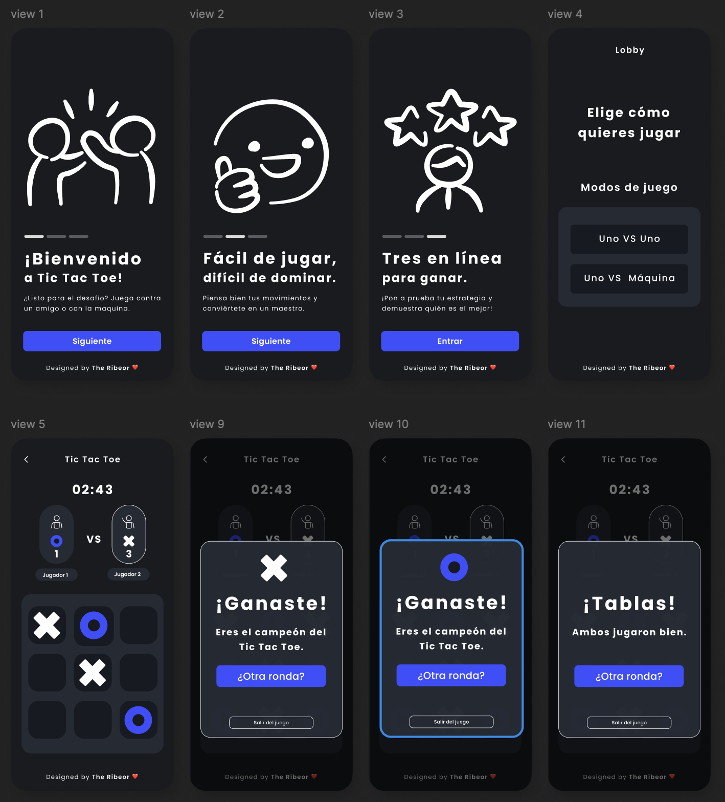

# Tic Tac Toe en React Native

¡Bienvenido al proyecto de Tic Tac Toe (Tres en Raya) desarrollado en React Native y Expo! Este es un juego clásico de Tic Tac Toe que puedes jugar en dos modos: Jugador vs Jugador (PVP) y Jugador vs Máquina.

### Expo Snack  

Prueba la versión interactiva del juego **Tic Tac Toe** en Expo Snack:  

➡️ [Tic Tac Toe - Expo Snack](https://snack.expo.dev/@diegoberrio1601/tic-tac-toue)  


## Características

- **Modos de juego**:
  - **PVP**: Juega contra otro jugador en el mismo dispositivo.
  - **AI**: Juega contra la máquina con una inteligencia artificial básica.
- **Interfaz intuitiva**: Diseño moderno y fácil de usar.
- **Temporizador**: Un temporizador opcional para agregar emoción al juego.
- **Mensajes de resultado**: Muestra mensajes de victoria, empate.
- **Reinicio fácil**: Un botón para reiniciar el juego en cualquier momento.

## Capturas de Pantalla




---
## Instalación ⚙️

Sigue estos pasos para configurar el proyecto en tu máquina local:

1. Clona el repositorio:

   ```bash
   git clone git@github.com:Diegoberrio1601/Tic-Tac_Toe.git
   ```
   o

    ```bash
   git clone https://github.com/Diegoberrio1601/Tic-Tac_Toe.git
   ```

2. Instala las dependencias:

   ```bash
   npm install
   ```

   o

   ```bash
   yarn install
   ```

3. Ejecuta la aplicación:

   ```bash
   npx expo star 
   ```

   o

   ```bash
   yarn expo star 
   ```

---

## Créditos 👏

- **Desarrollado por**: [Diego Berrio](https://github.com/Diegoberrio1601)
- **Inspiración**: Juegos clásicos.
- **Diseño Responsivo**: Interfaz optimizada para dispositivos móviles.

---


